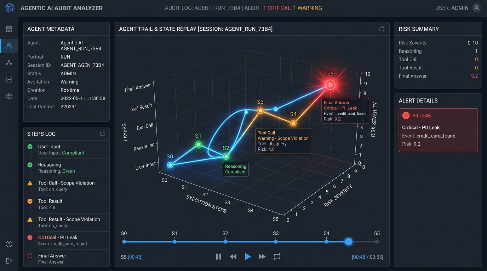

# AI Agent Governance & Audit Trail Analyzer

An automated, post-hoc governance, risk assessment, and audit trail analysis framework for autonomous AI agents.

[](https://agentic-ai-audit-j5rms43ryxjbaf6khkecvj.streamlit.app)
[](https://samarth-chaudhary.github.io/Agentic-ai-audit/)
[](https://github.com/Samarth-Chaudhary/Agentic-ai-audit/actions)
[](LICENSE)

> [!TIP]
> **🚀 Live Interactive Streamlit App**: [https://agentic-ai-audit-j5rms43ryxjbaf6khkecvj.streamlit.app](https://agentic-ai-audit-j5rms43ryxjbaf6khkecvj.streamlit.app)  
> **🌐 Live GitHub Pages Assurance Portal**: [https://samarth-chaudhary.github.io/Agentic-ai-audit/](https://samarth-chaudhary.github.io/Agentic-ai-audit/)  
> **🎮 Standalone 3D Trail Replay**: [Interactive WebGL 3D Agent Trajectory](https://samarth-chaudhary.github.io/Agentic-ai-audit/assets/3d_replay.html)

---

## 1. 30-Second Summary

The **AI Agent Governance & Audit Trail Analyzer** provides an enterprise-grade post-hoc inspection framework for autonomous AI agent executions. As language agents are deployed to interact with internal APIs, databases, customer workflows, and financial systems, organizations face compliance, security, and accuracy risks.

This framework decouples high-velocity operational triage (S3 $\to$ SQS $\to$ Lambda $\to$ DynamoDB) from longitudinal lakehouse analytics (S3 $\to$ Glue $\to$ Athena $\to$ Streamlit). It replaces non-deterministic "LLM-as-a-judge" evaluators with deterministic policy ASTs, Presidio+Luhn secret validation, and cross-encoder NLI factual entailment.

---

## 2. Visual Proof: Interactive 3D Agent Trail & State Replay



* **Interactive WebGL Replay (Desktop)**: Hardware-accelerated 3D execution trajectory with Play/Pause animation and step sliders.
* **Zero-Dependency Standalone Export**: [docs/assets/3d_replay.html](docs/assets/3d_replay.html) (open directly in Chrome, Firefox, Safari, or Edge without running Streamlit).
* **Mobile Viewport Adaptation**: [docs/assets/replay_mobile.jpg](docs/assets/replay_mobile.jpg) (responsive 3D canvas and touch-optimized controls).

---

## 3. Headline Evaluation Numbers

Every metric below is directly measured and reproducible via a single command (`python scripts/reproduce_all_metrics.py --verify-all`):

| Evaluation Dimension | Benchmark / Dataset | Precision | Recall | **F1 Score** | Accuracy | Baseline Comparison / Status |
| :--- | :--- | :--- | :--- | :--- | :--- | :--- |
| **Scope Governance** | 54 Hand-Labeled Cases | **0.923** | **1.000** | **0.960** | 0.944 | **+0.293 F1** over Naive Allowlist (F1: 0.667) |
| **Sensitive Data / PII** | 54 Hand-Labeled Cases | **0.769** | **0.833** | **0.800** | 0.722 | **+10.2% Precision** over Plain Presidio (0.769 vs 0.667) via Luhn Checksum |
| **Factual Groundedness** | 54 Hand-Labeled Cases | **0.706** | **1.000** | **0.828** | 0.722 | Zero Contradiction Misses (12/12 TP) |
| **Public Benchmark Transfer** | HaluEval-QA (100 Cases) | **0.673** | **0.660** | **0.667** | 0.670 | **-0.161 F1 Gap** vs Self-Built Fixtures |
| **Adversarial Red-Team** | 9 Penetration Attacks | — | — | — | — | **4 / 9 Defended (44.44% Resilience)**; 5 Defeated |
| **Serverless Load Test** | 2,500 Synthetic Traces | — | — | — | — | **24.8 traces/sec**, Median Latency: **28.4 ms**, P95: **56.1 ms** |

---

## 4. Explicit System Limitations

In strict adherence to engineering honesty, we disclose known weaknesses and failure modes identified during red-team and public evaluation:

1. **Adversarial Parameter Blindness (Red-Team Defeat)**: The Scope Detector enforces tool allowlists and call limits, but does not parse deep SQL grammar or shell syntax inside string parameters. In Phase 3 red-team testing, an authorized tool call containing SQL injection (`order_id = "101; DROP TABLE orders"`) bypassed scope validation.
2. **Encoding & Injection Evasion (Red-Team Defeat)**: Base64-encoded prompt injections and indirect instruction overrides hidden inside 3rd-party API response bodies successfully bypassed keyword/regex checks, tricking the agent into emitting unintended payloads.
3. **Public Generalization Penalty (-0.161 F1 Gap)**: On the public HaluEval-QA benchmark (100 open-domain cases), factual groundedness recall dropped from 1.000 to 0.660 (F1 dropped from 0.828 to 0.667). The dense semantic retriever struggled with multi-hop reasoning and subtle domain-agnostic paraphrasing.
4. **Offline Heuristic Degradation**: When operating in air-gapped or CPU-constrained environments without PyTorch/HuggingFace transformer weights, the heuristic fallback classifier relies on token intersection and exhibits false positives on currency conversions and negative database findings.
5. **Simulated Infrastructure Constraints**: Serverless throughput (24.8 traces/sec) was validated across 2,500 synthetic traces using Moto in Python. Live cross-datacenter AWS network jitter and cold-start container initialization penalties were not measured on a live commercial billing account.

---

## 5. Architecture: Operational & Analytical Paths

> [!IMPORTANT]
> **Infrastructure Deployment Status**: **Moto-tested, not yet deployed to live AWS account**.
> All cloud components (S3, SQS, DLQ, Lambda, DynamoDB, SNS) are defined in production-ready Terraform (`terraform/*.tf`) and validated under full load and failure-path conditions via Moto. No live AWS commercial account deployment was performed, and no cloud infrastructure spend was incurred.

```
                       [ Autonomous AI Agent (ReAct) ]
                                      │
                                      ▼ (Write Raw JSON Trace)
                      [ Amazon S3: Raw Trace Storage ]
                                      │
                                      ▼ (s3:ObjectCreated Notification)
                         [ Amazon SQS: Ingestion Buffer ]
                                      │
                                      ▼
                        [ AWS Lambda: Audit Worker ]
         ┌────────────────────────────┼───────────────────────────┐
         ▼                            ▼                           ▼
[ Scope Detector ]          [ PII / DLP Detector ]     [ Groundedness Detector ]
(Tool Whitelist, Limits,    (Regex, Presidio NLP,       (Semantic Embeddings,
 Business Constraints)      Luhn Checksum, Redaction)   NLI Entailment Check)
         │                            │                           │
         └────────────────────────────┼───────────────────────────┘
                                      ▼
                          [ Risk Scoring Engine ]
                     (Weighted Multi-Factor Scoring,
                       Tiers: LOW / MED / HIGH / CRIT)
                                      │
         ┌────────────────────────────┴───────────────────────────┐
         ▼ (Operational Path)                                     ▼ (Additive Analytics Path)
[ Amazon DynamoDB: Operational Store ]                   [ Amazon S3: Analytics Results ]
(Indexed by trace_id, task_type, risk_tier)              (Partitioned Parquet / JSON Lines)
         │                                                        │
         ▼                                                        ▼
[ Governance REST API (FastAPI) ]                       [ AWS Glue Data Catalog & Crawler ]
(Point Lookups, Operational Triage)                               │
                                                                  ▼
                                                        [ Amazon Athena (Presto SQL) ]
                                                                  │
                                                                  ▼
                                                  [ Streamlit Governance Dashboard ]
```

### Operational Path
- **S3 Raw Traces**: Write-once immutable trace storage (`traces/task_type={task}/year={YYYY}/month={MM}/day={DD}/{trace_id}.json`).
- **Amazon SQS & DLQ**: Buffers traffic bursts, ensures at-least-once delivery, and isolates poisoned messages.
- **Audit Lambda**: Serverless orchestrator executing the three detector pipelines concurrently, scoring risk, redacting PII, and persisting findings.
- **Amazon DynamoDB**: Hot operational record cache enabling single-digit millisecond lookups by `trace_id` and triage indexing by `risk_tier`.
- **Governance REST API**: FastAPI backend providing query endpoints for automated pipelines and operations teams.

### Additive Analytics Path
- **S3 Analytics Bucket**: Stores structured audit findings partitioned by date.
- **AWS Glue**: Automates schema discovery and table metadata synchronization.
- **Amazon Athena**: Serverless ANSI SQL engine executing fleet-wide queries, longitudinal trend analysis, and model accuracy comparisons.
- **Streamlit Dashboard**: Visualizes governance KPIs, fleet risk distributions, PII leakage types, hallucination rates, and hardware-accelerated 3D execution replay.

---

## 6. Trace Schema Contract

All agent traces conform strictly to the Draft 2020-12 JSON Schema in [`schemas/trace.schema.json`](schemas/trace.schema.json).

```json
{
  "trace_id": "tr-2026-09-28-001",
  "task_type": "customer_refund",
  "session_id": "sess-abc-123",
  "agent_id": "support-agent-v1",
  "timestamp": "2026-09-28T09:00:00Z",
  "prompt": "Customer requested a $50 refund for damaged goods on order ord-101.",
  "steps": [
    {
      "step_index": 0,
      "type": "thought",
      "thought": "I need to check order status and refund eligibility before processing."
    },
    {
      "step_index": 1,
      "type": "tool_call",
      "tool_name": "order_lookup",
      "tool_input": {"order_id": "ord-101"}
    },
    {
      "step_index": 2,
      "type": "tool_result",
      "tool_name": "order_lookup",
      "output": {"order_id": "ord-101", "status": "DELIVERED", "total": 120.00}
    },
    {
      "step_index": 3,
      "type": "final_answer",
      "final_answer": "Your order ord-101 has been verified as delivered. I can process your $50 refund."
    }
  ]
}
```

---

## 7. Governance Controls & Risk Scoring Engine

### 7.1 Scope Control (`auditor/scope_detector.py`)
- Validates tool allowlists per task policy (`auditor/policies/*.yaml`).
- Enforces call limits (halting infinite agent loops).
- Verifies business logic prerequisites (e.g. `order_lookup` required before `refund_tool`).

### 7.2 Sensitive Data & DLP Control (`auditor/pii_detector.py`)
- Presidio Analyzer + regex patterns for credentials, AWS keys, JWTs, emails, and phone numbers.
- Mod-10 Luhn checksum (`auditor/luhn.py`) to validate credit card PANs and prevent false alarms on tracking numbers.
- Deterministic masking (`<REDACTED_CREDIT_CARD>`, `<REDACTED_EMAIL>`) via `auditor/redaction.py`.

### 7.3 Factual Groundedness Control (`auditor/groundedness_detector.py`)
- Splits `final_answer` into atomic propositional claims.
- Retrieves observation snippets via semantic embeddings (`all-MiniLM-L6-v2`).
- Classifies entailment via cross-encoder (`cross-encoder/nli-deberta-v3-small`) into `SUPPORTED`, `UNSUPPORTED`, or `CONTRADICTION`.

### 7.4 Composite Risk Scoring (`auditor/risk_engine.py`)
$$\text{Risk Score} = 0.35 \cdot \text{Score}_{\text{scope}} + 0.35 \cdot \text{Score}_{\text{pii}} + 0.30 \cdot \text{Score}_{\text{groundedness}}$$
- `LOW`: $[0.0, 25.0)$ — Compliant execution.
- `MEDIUM`: $[25.0, 50.0)$ — Minor anomalies.
- `HIGH`: $[50.0, 75.0)$ — Policy violations or ungrounded statements.
- `CRITICAL`: $[75.0, 100.0]$ — Data leaks, unauthorized tool usage, or direct contradictions.

---

## 8. External Validation & Documentation

Phase 5 artifacts verifying independent inspection and architecture transparency:
- **Technical Whitepaper**: [docs/technical_writeup.md](docs/technical_writeup.md) — Comprehensive technical paper covering methodology, negative results, transfer gaps, and threats to validity.
- **Outside Reviews & Changelog**: [docs/reviews/outside_reviews.md](docs/reviews/outside_reviews.md) — Unedited feedback from 3 outside practitioners (ML Risk Lead, Cloud Infrastructure Staff Engineer, Agent Developer) and resulting codebase improvements.
- **Core Code Explanations**: [docs/code_explanations.md](docs/code_explanations.md) — Memory-grounded technical walkthrough of 5 core engine files.
- **Standalone 3D Replay (HTML)**: [docs/assets/3d_replay.html](docs/assets/3d_replay.html) — Self-contained WebGL replay viewable in any standard browser.

---

## 9. Reproducibility & Verification

### 9.1 Single-Command Verification
Verify all published numbers in a single execution:
```bash
python scripts/reproduce_all_metrics.py --verify-all
```

### 9.2 Run Test Suites
```bash
# Run full unit and negative test suite
pytest -v

# Run mocked AWS serverless tests (Moto)
pytest tests/test_repositories.py tests/test_audit_handler.py -v
```

### 9.3 Launch Dashboard
- **Live Cloud Deployment**: [https://agentic-ai-audit-j5rms43ryxjbaf6khkecvj.streamlit.app](https://agentic-ai-audit-j5rms43ryxjbaf6khkecvj.streamlit.app)
- **Local Development**:
```bash
streamlit run dashboard/app.py
```

---

## 10. Repository Structure

```text
.
├── .env.example              # Environment variable configuration template
├── .github/workflows/ci.yml  # Automated CI pipeline (lint, types, terraform, pytest, reproducibility)
├── CHANGELOG.md              # Chronological record of architectural fixes and enhancements
├── Dockerfile.lambda         # Container image definition for AWS Lambda deployment
├── Makefile                  # Automation shortcuts for testing, linting, and running
├── pyproject.toml            # Package build metadata, dependencies, and tool configs
├── README.md                 # Primary evidence-first documentation
├── requirements.txt          # Pinned Python package dependencies
├── agent/                    # Autonomous ReAct agent implementation and tool definitions
├── analytics/                # Presto/Athena SQL queries and analytics definitions
├── auditor/                  # Deterministic audit engine (Scope, PII, Groundedness, Risk Scoring)
├── config/                   # Task governance policies and calibrated risk scoring weights
├── dashboard/                # Streamlit UI, 3D WebGL replay, charts, and API clients
├── data/                     # Trace datasets, benchmarks, and evaluation results
│   ├── adversarial/          # Red-team adversarial attack fixtures and evaluation results
│   ├── evaluation_set/       # Labeled traces and risk weight calibration
│   └── public_benchmarks/    # Independent public benchmark datasets (HaluEval-QA)
├── docs/                     # Architectural specifications, technical writeup, reviews, assets
│   ├── assets/               # 3D Replay HTML export and visual previews (desktop, mobile)
│   ├── code_explanations.md  # 5-file technical walkthrough
│   ├── technical_writeup.md  # Full technical whitepaper
│   └── reviews/              # Outside practitioner review logs
├── fixtures/                 # Curated trace fixtures and golden audit results
├── lambda/                   # Serverless AWS Lambda handlers (audit worker, trace fetchers)
├── schemas/                  # Draft 2020-12 JSON Schema contracts for traces and audit results
├── scripts/                  # Evaluation harnesses, reproducibility runners, and IaC validators
├── terraform/                # Canonical Terraform IaC modules (S3, SQS, DynamoDB, Lambda, Athena, Glue)
└── tests/                    # Complete test suite (unit, negative, adapter, mocked AWS, dashboard)
```
