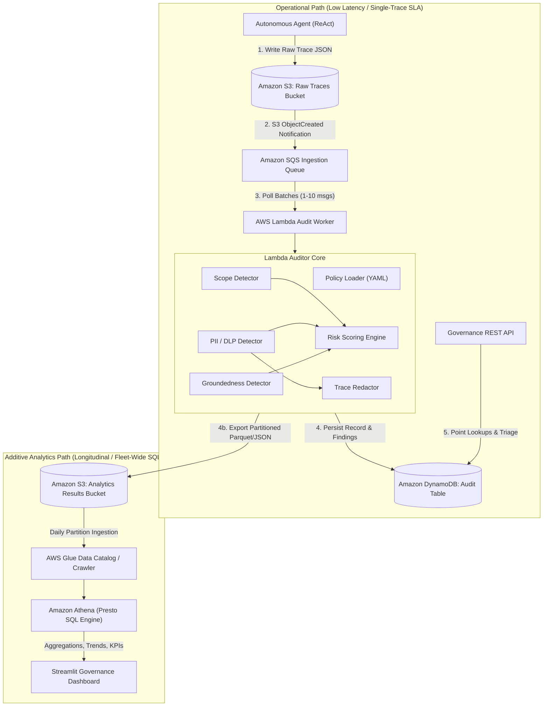

# Architecture Specification: AI Agent Governance & Audit Trail Analyzer

This document provides the definitive architectural blueprint for the **AI Agent Governance & Audit Trail Analyzer**. The system operates post-hoc, analyzing immutable execution traces generated by autonomous AI agents against strict governance policies, data protection regulations, and groundedness constraints.

---

## 1. Dual-Path Architecture Overview

The system strictly decouples the high-throughput, low-latency **Operational Path** from the longitudinal, aggregated **Additive Analytics Path**.

---

## 2. Core Architectural Components

### 2.1 Agent (ReAct Framework)
- **Role**: Executes user tasks (e.g. customer refunds, research summarization) via an iterative Reasoning + Acting loop.
- **Trace Capture**: Intercepts prompt inputs, internal reasoning steps (`thoughts`), tool invocations (`tool_name`, `tool_input`), observed tool outputs (`output`), and the final response (`final_answer`).
- **Telemetry**: Records total wall-clock execution time, step counts, token counts, and session metadata.
- **Contract Conformance**: Emits traces adhering strictly to [`schemas/trace.schema.json`](file:///c:/Users/Samarth%20Chaudhary/Downloads/Agentic%20AI%20Audit/schemas/trace.schema.json).

### 2.2 Raw Trace Storage (Amazon S3)
- **Bucket**: `agent-audit-raw-traces-{environment}`
- **Immutability**: S3 Object Lock (WORM - Write Once, Read Many) or restrictive IAM bucket policies preventing `s3:PutObject` overwrites and `s3:DeleteObject`.
- **Key Prefix Hierarchy**: `traces/task_type={task_type}/year={YYYY}/month={MM}/day={DD}/{trace_id}.json`
- **Metadata**: Stores trace schema version, agent version, and ingestion timestamp as S3 object metadata.

### 2.3 SQS Ingestion Buffer & Dead Letter Queue (DLQ)
- **Role**: Decouples trace generation from audit processing, buffering spikes in agent activity and ensuring zero trace loss.
- **Queue Properties**:
  - `VisibilityTimeout`: 300 seconds (5x Lambda execution timeout).
  - `MessageRetentionPeriod`: 14 days.
  - `RedrivePolicy`: Maximum 3 receive attempts before moving failed messages to `agent-audit-ingestion-dlq`.
- **Event Structure**: Receives standard S3 `s3:ObjectCreated:*` notification envelopes containing the bucket name and object key.

### 2.4 Audit Lambda Worker
- **Runtime**: Python 3.11 with container image or Lambda layer containing HuggingFace NLP runtimes and Microsoft Presidio.
- **Handler**: [`lambda/audit_handler.lambda_handler`](file:///c:/Users/Samarth%20Chaudhary/Downloads/Agentic%20AI%20Audit/lambda/audit_handler.py).
- **Execution Flow**:
  1. Unpacks SQS message body to extract S3 bucket and key.
  2. Retrieves raw trace JSON from S3.
  3. Validates trace against Pydantic schema and Task Policy.
  4. Dispatches trace concurrently across the three audit detectors.
  5. Computes composite risk score and deterministic narrative summary.
  6. Redacts sensitive PII from trace output.
  7. Persists operational audit record to DynamoDB.
  8. Emits analytics record to S3 Analytics bucket.
  9. Publishes SNS alert if risk tier is `HIGH` or `CRITICAL`.

### 2.5 The Three Audit Detectors
1. **Scope Detector** ([`auditor/scope_detector.py`](file:///c:/Users/Samarth%20Chaudhary/Downloads/Agentic%20AI%20Audit/auditor/scope_detector.py)):
   - **Allowed Tools**: Verifies every step `tool_name` is explicitly permitted for the declared `task_type`.
   - **Invocation Limits**: Enforces `max_calls` ceilings per tool and overall trace to prevent execution loops.
   - **Business Rules**: Validates domain logic preconditions (e.g. `order_lookup` must precede `process_refund`, refund amount cannot exceed order total).
2. **Sensitive Data / PII Detector** ([`auditor/pii_detector.py`](file:///c:/Users/Samarth%20Chaudhary/Downloads/Agentic%20AI%20Audit/auditor/pii_detector.py)):
   - **Deterministic Regex Recognizers**: Scans for AWS access keys (`AKIA...`), bearer tokens, passwords, emails, and phone numbers.
   - **Credit Card / Luhn Validation**: Applies Luhn algorithm (Modulo 10) to 13-19 digit candidate numbers to eliminate false positive numeric IDs.
   - **Presidio NLP Recognizers**: Leverages SpaCy models for named entity extraction (`PERSON`, `LOCATION`, `ORGANIZATION`).
   - **Contextual Awareness**: Classifies findings by context (e.g. acceptable in internal DB tool output vs critical violation if leaked in `final_answer`).
3. **Groundedness Detector** ([`auditor/groundedness_detector.py`](file:///c:/Users/Samarth%20Chaudhary/Downloads/Agentic%20AI%20Audit/auditor/groundedness_detector.py)):
   - **Claim Extraction**: Decomposes `final_answer` into atomic factual assertions using regex clause chunking or LLM decomposition.
   - **Evidence Retrieval**: Encodes tool observations and claims into dense vector embeddings (`all-MiniLM-L6-v2`) and identifies top candidate premise passages via cosine similarity.
   - **Natural Language Inference (NLI)**: Evaluates claim vs evidence pairs with a cross-encoder NLI model (`roberta-large-mnli`), producing categorical verdicts: `ENTAILMENT` (`SUPPORTED`), `NEUTRAL` (`UNSUPPORTED`), or `CONTRADICTION` (`CONTRADICTED`).

### 2.6 Risk Scoring Engine ([`auditor/risk_engine.py`](file:///c:/Users/Samarth%20Chaudhary/Downloads/Agentic%20AI%20Audit/auditor/risk_engine.py))
- **Mathematical Model**:
  $$\text{ScopeScore} = \min(100.0, \sum W_{\text{scope}}(\text{severity}))$$
  $$\text{PIIScore} = \min(100.0, \sum W_{\text{pii}}(\text{severity}))$$
  $$\text{GroundednessScore} = \min\left(100.0, \frac{1.0 \cdot N_{\text{contradicted}} + 0.7 \cdot N_{\text{unsupported}}}{N_{\text{claims}}} \times 100\right)$$
  $$\text{OverallRisk} = \min(100.0, 0.35 \cdot \text{ScopeScore} + 0.35 \cdot \text{PIIScore} + 0.30 \cdot \text{GroundednessScore})$$
- **Risk Tiers**:
  - $0.0 \le \text{Score} < 20.0 \implies \mathbf{LOW}$
  - $20.0 \le \text{Score} < 50.0 \implies \mathbf{MEDIUM}$
  - $50.0 \le \text{Score} < 80.0 \implies \mathbf{HIGH}$
  - $\text{Score} \ge 80.0 \implies \mathbf{CRITICAL}$
- **Deterministic Summary**: Builds human-readable narrative strictly explaining which specific findings triggered the score.

### 2.7 Operational Database (Amazon DynamoDB)
- **Table**: `AgentAuditResults`
- **Primary Key**: `trace_id` (String - Partition Key).
- **Global Secondary Index (GSI1)**: `task_type` (PK), `created_at` (SK) for task-filtered operational lookups.
- **Global Secondary Index (GSI2)**: `risk_tier` (PK), `overall_score` (SK) for triage queues (e.g. all `CRITICAL` traces).
- **Retention**: Point-in-time recovery (PITR) enabled; TTL attribute `expires_at` set to 90 days.

### 2.8 Analytics Data Lake (S3, AWS Glue, Amazon Athena)
- **Analytics S3 Bucket**: `agent-audit-analytics-results-{environment}`
- **Format**: Parquet or JSON lines partitioned by `year=YYYY/month=MM/day=DD/`.
- **AWS Glue Catalog**: Database `agent_audit_analytics`, table `audit_analytics` declaring structured schema including nested violation arrays and sub-scores.
- **Amazon Athena**: Serverless Presto query engine executing SQL over partitioned S3 data without server management. Workgroup enforces query byte limits and encrypted query results.

### 2.9 Governance REST API (FastAPI)
- **Modules**: [`api/`](file:///c:/Users/Samarth%20Chaudhary/Downloads/Agentic%20AI%20Audit/api) exposing endpoints:
  - `GET /traces/{trace_id}`: Retrieves full audit result from DynamoDB.
  - `GET /traces`: Paginated listing with filtering by `task_type`, `risk_tier`, and date range.
  - `GET /policies`: Returns active task policies and risk thresholds.
  - `POST /audit`: Synchronous on-demand audit evaluation endpoint for pre-commit verification.

### 2.10 Streamlit Governance Dashboard ([`dashboard/`](file:///c:/Users/Samarth%20Chaudhary/Downloads/Agentic%20AI%20Audit/dashboard))
- **Live Monitoring View**: Queries DynamoDB via API client for real-time trace inspection, redacted previews, and triage decisions.
- **Fleet Analytics View**: Executes analytical queries through Athena client:
  - Fleet risk tier distribution (pie / donut charts).
  - Risk trends over time (daily rolling average).
  - Scope and PII violation breakdown by tool.
  - Factual hallucination and contradiction rate by model/agent version.

---

## 3. Operational Path vs. Analytical Path Comparison

| Dimension | Operational Path | Additive Analytics Path |
| :--- | :--- | :--- |
| **Primary Goal** | Trace ingestion, risk evaluation, and immediate triage. | Fleet governance, compliance auditing, longitudinal trends. |
| **Technology** | S3 $\to$ SQS $\to$ Lambda $\to$ DynamoDB $\to$ REST API | Lambda $\to$ S3 Analytics $\to$ Glue $\to$ Athena $\to$ Dashboard |
| **Latency SLA** | $< 2$ seconds per trace | Minutes (scheduled or ad-hoc SQL execution) |
| **Data Access Pattern** | Point read by `trace_id` or indexed query by `risk_tier` | Scans across millions of historical trace records |
| **Consistency** | Strong consistency on DynamoDB writes | Eventual consistency over partitioned object storage |
| **Retention Policy** | 90 days operational hot cache (DynamoDB TTL) | 7 years archived lakehouse storage (S3 Glacier transition) |
| **Failure Blast Radius** | Isolated to single SQS message; retries via DLQ | Failure in Glue/Athena does not interrupt operational audits |
